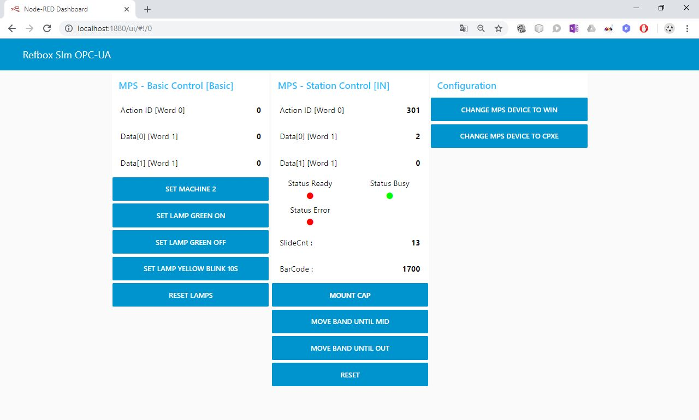

# RCLL-MPS (Modular Production Systems)
Software running on Festo MPS stations using in the RCLL

## MPS_OPC
MPS-Control-Software for BS/CS/RS/DS (except SS) runs on Codesys V3.5
GUI: http://localhost:8080/webvisu.htm

## MPS_Sim
MPS-Mockup Example with CapStation-Simulation(CS) runs on Codesys V3.5
GUI: http://localhost:8080/webvisu.htm
 
### Video Tutorial:
[](./doc/MPSSim.mp4)

## NodeRED_RefboxSim_OPC_UA
RefBox-Mockup with OPC-UA running in Node-RED

Install Node-RED: https://nodered.org/docs/getting-started/installation
or
Installation as a docker container:
```
docker run -itd --name nodered -p 1880:1880 -p 1883:1883 -p 4840:4840 nodered/node-red-docker
```

### Video Tutorial:
[](./doc/RefBoxSim.mp4)

Install additional node for opc-comm: https://flows.nodered.org/node/node-red-contrib-opcua

Import the flow from txt-file [NodeRED_RefboxSim_OPC_UA.txt](./NodeRED_RefboxSim_OPC_UA.txt)

Mockup-GUI: http://localhost:1880/ui


## Test Demo

### Video Tutorial
[](./doc/RunDemo.mp4)